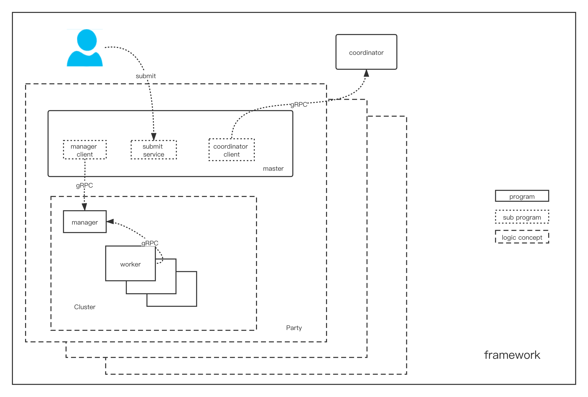

### Overview



There are two `role` associated in `FedVision`:

1. coordinator
    
2. Party


`Coordinator` is an independent role responsible for handling job publish and
distribute subtasks to proper parties that have subscribed to the `coordinator`.
Usually, the `coordinator` must be started before any party can subscribe to it.
The `party` will post the job of the specified `job_type` to the coordinator and wait for `proposal_waiting_time` seconds.
While waiting, all `party` subscribed to this `job_type` will received a message,
and then decide whether to participate or not. After the waiting time is over, the `coordinator` selects a group of `party`
as a participants in this job.

`Party` is an independent role that publishes or subscribe jobs. usually,
It has a `Cluster` to process assigned tasks, and a `submit service` to process work requests from `Users`,
a `coordinator clients publish jobs to `Coordinator` or subscribe jobs from "Coordinator" and, a `master` to mixes them up.

### Job's Life Cycle


The FedVision framework is an extensible framework. 
When the master receives the job submit request, 
it will use different job loader according to the `job_type` parameter.
This makes it possible to extent `FedVision` framework with various machine learning frameworks.

Currently, only `PaddlePaddle` supported with extension configuration file:

```yaml
PaddleFL:
  jobs:
    - name: paddle_fl
      schema: ../schema/paddle_fl.json
      loader: fedvision.paddle_fl.job:PaddleFLJob
  tasks:
    - name: fl_trainer
      loader: fedvision.paddle_fl.tasks.task.trainer:FLTrainer
    - name: fl_aggregator
      loader: fedvision.paddle_fl.tasks.task.aggregator:FLAggregator
```

To implement an new extension, one need to

1. add configuration to [extensions.yaml](https://github.com/FederatedAI/FedVision/blob/main/conf/extensions.yaml)

2. implement [abstract job class](https://github.com/FederatedAI/FedVision/blob/main/fedvision/framework/abc/job.py)

3. implement several [abstract task class](https://github.com/FederatedAI/FedVision/blob/main/fedvision/framework/abc/task.py) used by job. 

