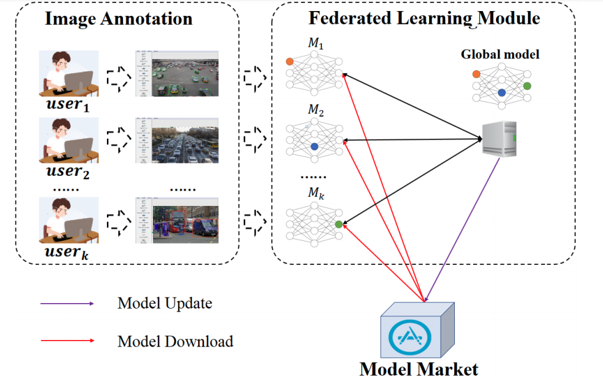

FedVision is a Visual Object Detection Platform Powered by Federated Learning

At this version, FedVision utilize 
 [PaddleFL](https://github.com/PaddlePaddle/PaddleFL) 
 and [PaddleDetection](https://github.com/PaddlePaddle/PaddleDetection) 
 to achieve `Gradient Average` strategy. This project is in really early stage but we aim to implement many
 awesome functions such as `google's secure aggregation protocol` and `Gradient compression`.
 